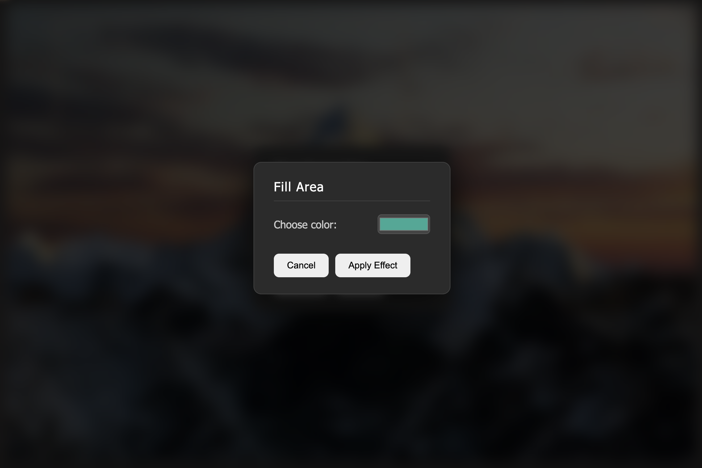
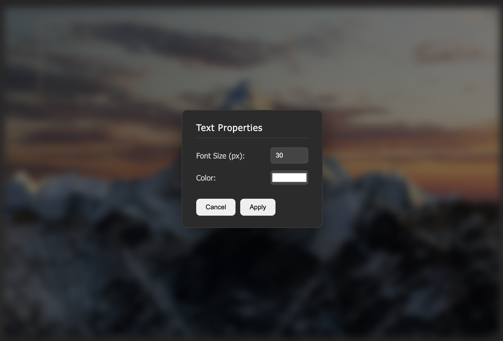

# 🖼️ Quick Image Editor Website

A basic web-based image editor built purely with **Vanilla JavaScript, HTML, and CSS**. This tool allows users to upload an image and perform common editing tasks such as selection, cropping, deletion, scaling, and adding colored fills and text overlays.


# ✨ Features

* **Image Upload:** Supports file input and Drag & Drop functionality.

* **Dynamic Canvas:** A drawing canvas is dynamically aligned and scaled over the displayed image, ensuring all edits are pixel-accurate regardless of screen size.

* **Selection Tool (Select):**

    * Draw rectangular selections.

    * **Move Selection:** Hold **Shift** while dragging inside an existing selection to move it.

* **Image Editing Tools:**

    * **Crop:** Permanently crops the image to the selected area.

    * **Delete:** Fills the selected area with **white** (simulating deletion).

    * **Fill Effect:** Fills the selected area with a user-defined color (using a modal for UX).

    * **Text:** Adds a text input field over the selected area, allowing the user to write text onto the image with customizable size and color (using a modal for UX).

    * **Save:** Downloads the currently modified image as a PNG file.

# 🛠️ Technologies Used
* HTML5

* CSS3

* JavaScript (Vanilla) with a focus on DOM manipulation and Canvas API for image processing.






# 🚀 Getting Started
## Prerequisites
You only need a modern web browser to run this project.

## Installation & Setup
1. **Clone the repository:**

```
git clone https://github.com/EduardCovrig/ImageEditor-Website

cd ImageEditor-Website
```

*If this is a local project without a repo, simply ensure you have the index.html, styles.css and the JavaScript file (containing the provided code) in the same directory.*

2. **Open the file:** Open the main HTML file (index.html) directly in your web browser.

# 📖 How to Use
1. **Upload Image:** Click the **"Upload File"** button or **Drag & Drop** an image file onto the central area.

1. **Select a Tool:** Click one of the buttons in the tool palette (e.g., Select, Crop, Text).

1. **Make a Selection:** Click and drag on the image area to define a rectangular selection.

1. **Apply Action:**

    * For *Select* (and related tools like Delete, Effect, Text), the action is typically triggered when you release the mouse button (mouseup).

    * For *Crop*, the action is applied immediately when you click the tool button after making a selection.

    * *Text* and *Effect* will open a **modal** for settings before applying the change.

1. **Save:** Click the Save button to download your final edited image as a PNG.

**Keyboard Shortcuts (Text Tool)**

* **Enter:** Finalizes the text and writes it onto the image.

* **Escape:** Discards the text input and returns to the Select tool.

